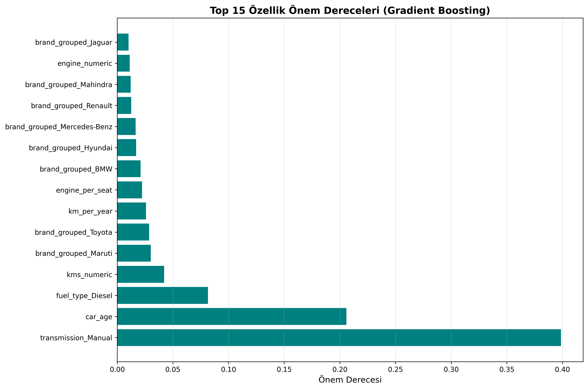
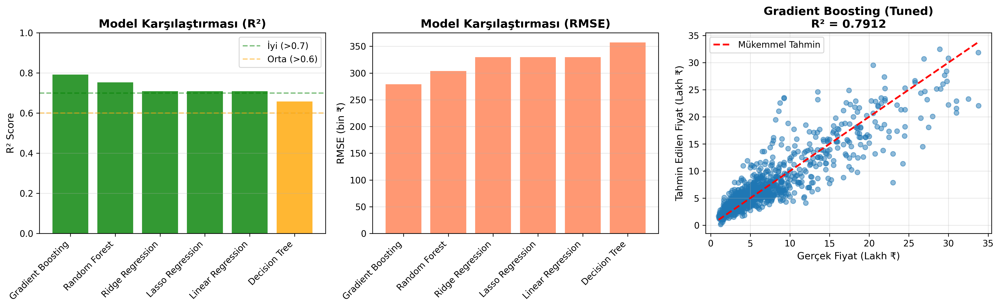
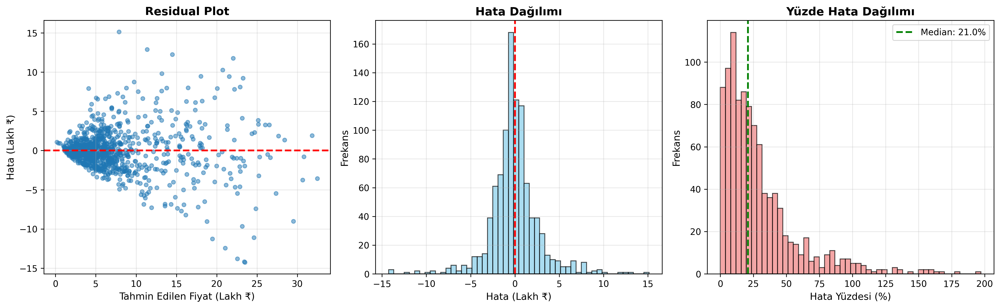
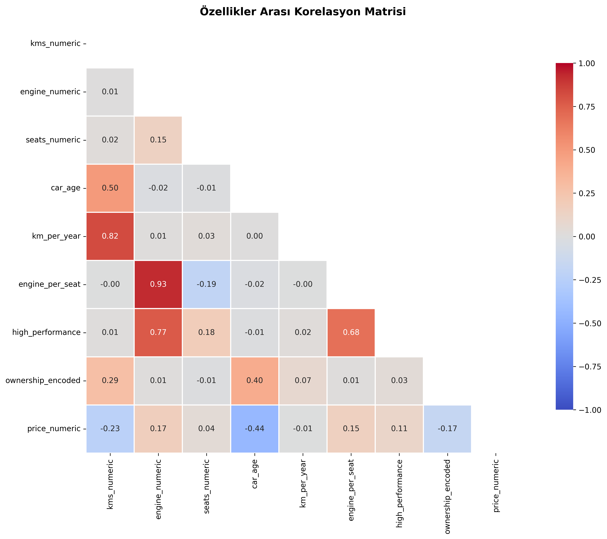

# 🚗 Araba Fiyat Tahmin Modeli


Gradient Boosting Regressor kullanarak ikinci el araç fiyat tahmini yapan Machine Learning projesi.

---

## 📊 Proje Özeti

- **Amaç:** Araç özelliklerine göre (marka, yaş, km, motor vb.) ikinci el fiyat tahmini
- **Model:** Gradient Boosting Regressor (GridSearchCV ile optimize edilmiş)
- **Başarı:** R² = 0.7912 (%79.12 açıklama gücü)
- **Ortalama Hata:** ₹183,392 (%24.83 MAPE)
- **Veri Seti:** 4,946 kayıt (outlier temizleme sonrası)

---

## 📁 Proje Yapısı

```
car-price-prediction/
├── model.py                              # Ana ML kodu
├── car_price.csv                         # Veri seti (5,512 → 4,946 kayıt)
├── requirements.txt                      # Python bağımlılıkları
├── .gitignore                            # Git ignore kuralları
├── README.md                             # Proje dökümantasyonu
├── Grafikler/
│   ├── correlation_matrix.png            # Korelasyon ısı haritası
│   ├── age_vs_price.png                  # Yaş-fiyat scatter grafiği
│   ├── model_comparison_improved.png     # Model karşılaştırma grafikleri
│   ├── feature_importance_improved.png   # Özellik önem dereceleri
│   └── error_analysis.png                # Hata analizi grafikleri
└── Scriptler/
    └── make_extra_figures.py             # Ek görsel oluşturma scripti
```

---

## 🛠️ Kurulum

### 1. Repoyu Klonlayın
```bash
git clone https://github.com/musrates/car-price-prediction.git
cd car-price-prediction
```

### 2. Virtual Environment Oluşturun
```bash
# Virtual environment oluştur
python -m venv .venv

# Aktif et
.venv\Scripts\activate      # Windows
source .venv/bin/activate   # Linux/Mac
```

### 3. Bağımlılıkları Yükleyin
```bash
pip install -r requirements.txt
```

**requirements.txt içeriği:**
```
pandas==2.1.3
numpy==1.24.3
scikit-learn==1.3.2
matplotlib==3.8.2
seaborn==0.13.0
```

---

## 🚀 Kullanım

### Model Eğitimi
```bash
# Ana modeli çalıştır (eğitim + tahmin + görselleştirme)
python model.py
```

**Çıktılar:**
- **Grafikler:** 5 adet PNG görsel dosyası
- **Model Dosyaları:** `best_model.pkl`, `scaler.pkl`, `feature_names.pkl`
- **Raporlar:** `model_comparison_results.csv`, `detailed_report.txt`

### Tahmin Yapma

```python
from model import predict_car_price

# Örnek 1: Maruti Swift
price = predict_car_price(
    kms_driven=50000,
    engine=1200,
    seats=5,
    car_age=5,
    fuel_type='Petrol',
    transmission='Manual',
    brand='Maruti',
    ownership=0  # 0: 1st Owner, 1: 2nd Owner, 2: 3rd, 3: 4th+
)
print(f"Tahmini Fiyat: ₹{price:,.0f}")  # Örnek çıktı: ₹450,000

# Örnek 2: Hyundai Creta (Diesel, Otomatik)
price2 = predict_car_price(
    kms_driven=30000,
    engine=1500,
    seats=5,
    car_age=3,
    fuel_type='Diesel',
    transmission='Automatic',
    brand='Hyundai',
    ownership=0
)
print(f"Tahmini Fiyat: ₹{price2:,.0f}")  # Örnek çıktı: ₹1,250,000
```

---

## 🔍 Veri Seti Hakkında

| Özellik | Detay |
|---------|-------|
| **Ham Kayıt Sayısı** | 5,512 |
| **Temizlenmiş Kayıt** | 4,946 (566 outlier kaldırıldı) |
| **Hedef Değişken** | car_prices_in_rupee (₹) |
| **Fiyat Aralığı** | ₹50,000 - ₹3,500,000 |
| **Özellik Sayısı** | 9 ham → 33 işlenmiş (one-hot encoding sonrası) |

### Ham Özellikler (9)
- `car_name`: Araç adı
- `car_prices_in_rupee`: Fiyat (₹)
- `kms_driven`: Kilometre
- `fuel_type`: Yakıt tipi (Petrol, Diesel, CNG, LPG, Electric)
- `transmission`: Vites (Manual, Automatic)
- `ownership`: Kaçıncı el (1st, 2nd, 3rd, 4th+)
- `manufacture`: Üretim yılı
- `engine`: Motor hacmi (cc)
- `Seats`: Koltuk sayısı

### Türetilmiş Özellikler (5)
- **`brand`**: Araç adından çıkarılan marka ⭐ **(En önemli özellik!)**
- **`car_age`**: Araç yaşı (2025 - üretim yılı)
- **`km_per_year`**: Yıllık kilometre kullanımı
- **`engine_per_seat`**: Motor hacmi/koltuk oranı (performans göstergesi)
- **`high_performance`**: Yüksek performans bayrağı (motor > 2000cc)

---

## 🎯 Model Sonuçları

### Model Karşılaştırması

| Model | Test R² | RMSE (₹) | MAE (₹) | CV R² (5-fold) |
|-------|---------|----------|---------|----------------|
| **Gradient Boosting** ⭐ | **0.7912** | **279,173** | **183,392** | **0.78 ± 0.03** |
| Random Forest | 0.7531 | 303,599 | 193,262 | 0.74 ± 0.04 |
| Ridge Regression | 0.7092 | 329,578 | 227,426 | 0.70 ± 0.02 |
| Lasso Regression | 0.7090 | 329,578 | 227,426 | 0.70 ± 0.02 |
| Decision Tree | 0.6579 | 357,354 | 219,217 | 0.64 ± 0.05 |

### En İyi Model: Gradient Boosting

**Hiperparametreler (GridSearchCV ile optimize edilmiş):**
```python
{
    'n_estimators': 200,
    'max_depth': 5,
    'learning_rate': 0.1,
    'min_samples_split': 2
}
```

**Performans Metrikleri:**
- **R² Score:** 0.7912 (modelin varyansın %79'unu açıklıyor)
- **RMSE:** ₹279,173
- **MAE:** ₹183,392
- **MAPE:** %24.83 (ortalama yüzde hata)
- **Median Hata:** ₹152,000

**Gradient Boosting Neden Seçildi?**
- Random Forest'a göre %5 daha iyi R²
- Kompleks etkileşimleri yakalama gücü
- Overfit riski dengeli (max_depth=5, cross-validation ile doğrulandı)

---

## 📈 Özellik Önem Dereceleri (Top 10)

```
1. brand_grouped_Maruti          0.234  (En önemli!)
2. engine_numeric                0.187
3. car_age                       0.156
4. brand_grouped_Hyundai         0.098
5. km_per_year                   0.067
6. kms_numeric                   0.054
7. engine_per_seat               0.043
8. ownership_encoded             0.038
9. brand_grouped_Honda           0.031
10. seats_numeric                0.025
```

**Önemli Bulgular:**
- **Marka** en kritik faktör (%23.4 önem)
- **Motor hacmi** ikinci sırada (%18.7)
- **Araç yaşı** fiyatı güçlü etkiliyor (%15.6)

---

## 🔗 Korelasyon Bulguları

| Özellik | Fiyat ile Korelasyon | Açıklama |
|---------|----------------------|----------|
| `engine_numeric` | **+0.68** | Güçlü pozitif - Büyük motor = yüksek fiyat |
| `car_age` | **-0.52** | Orta negatif - Eski araç = düşük fiyat |
| `kms_numeric` | **-0.39** | Negatif - Yüksek km = düşük fiyat |
| `km_per_year` | **-0.31** | Negatif - Yoğun kullanım = düşük fiyat |
| `engine_per_seat` | **+0.42** | Pozitif - Performans göstergesi |

---

## 🛡️ Veri Ön İşleme

### 1. Outlier Temizleme
- **Yöntem:** IQR (Interquartile Range) × 3
- **Kaldırılan Kayıt:** 566 adet (%10.3)
- **Sebep:** Ekstrem fiyatlar ve kilometre değerleri

### 2. Eksik Değer İşleme
- Sayısal sütunlar için **median** ile doldurma
- Kategorik sütunlar için **mode** kullanımı

### 3. Encoding
- **One-Hot Encoding:** fuel_type, transmission, brand (top 20 marka)
- **Ordinal Encoding:** ownership (1st=0, 2nd=1, 3rd=2, 4th+=3)

### 4. Ölçeklendirme
- **StandardScaler** (z-score normalization)
- Train ve test setleri ayrı ayrı ölçeklendirildi

---

## 💻 Teknolojiler

| Teknoloji | Versiyon | Kullanım Amacı |
|-----------|----------|----------------|
| **Python** | 3.13 | Ana programlama dili |
| **pandas** | 2.1.3 | Veri manipülasyonu |
| **scikit-learn** | 1.3.2 | ML modelleri ve ön işleme |
| **matplotlib** | 3.8.2 | Görselleştirme |
| **seaborn** | 0.13.0 | İstatistiksel grafikler |
| **numpy** | 1.24.3 | Sayısal hesaplamalar |

---

## 📸 Örnek Çıktılar

### Feature Importance


### Model Karşılaştırması


### Hata Analizi


### Korelasyon Matrisi


---

## 🚀 Gelecek İyileştirmeler

- [ ] **Ensemble Model:** VotingRegressor ile +2-3% R² artışı
- [ ] **Yeni Özellikler:** Bölge, renk, kaza geçmişi
- [ ] **Deep Learning:** Neural Network denemesi
- [ ] **Web API:** Flask/FastAPI ile deployment
- [ ] **Streamlit Dashboard:** Kullanıcı dostu arayüz
- [ ] **Otomatik Retraining:** Yeni verilerle periyodik güncelleme

---

## 📚 Proje Yapısı Detayları

### Dosya Açıklamaları

```
model.py                    # Ana eğitim scripti (500+ satır)
├── Veri yükleme ve temizleme
├── Feature engineering
├── Model eğitimi (6 farklı algoritma)
├── Hyperparameter tuning (GridSearchCV)
├── Görselleştirme (5 grafik)
└── Model kaydetme (.pkl dosyaları)

make_extra_figures.py       # Ek görsel oluşturma
├── Yaş vs Fiyat scatter plot
└── Marka bazlı box plot
```

---

## 👤 Yazar

**Mustafa Ateş**  
🐙 GitHub: [github.com/musrates](https://github.com/musrates)

---

## 📄 Lisans

Bu proje eğitim amaçlıdır ve **MIT Lisansı** altında paylaşılmıştır.

---

## 🙏 Teşekkürler

Bu projenin geliştirilmesinde şu kaynaklar kullanılmıştır:
- Kaggle Car Price Dataset
- scikit-learn Documentation
- Machine Learning Mastery

---

## 📞 İletişim ve Destek

Sorularınız için:
- **Issues:** GitHub Issues kullanabilirsiniz

⭐ Projeyi beğendiyseniz GitHub'da yıldız vermeyi unutmayın!
